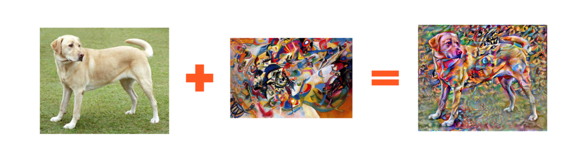
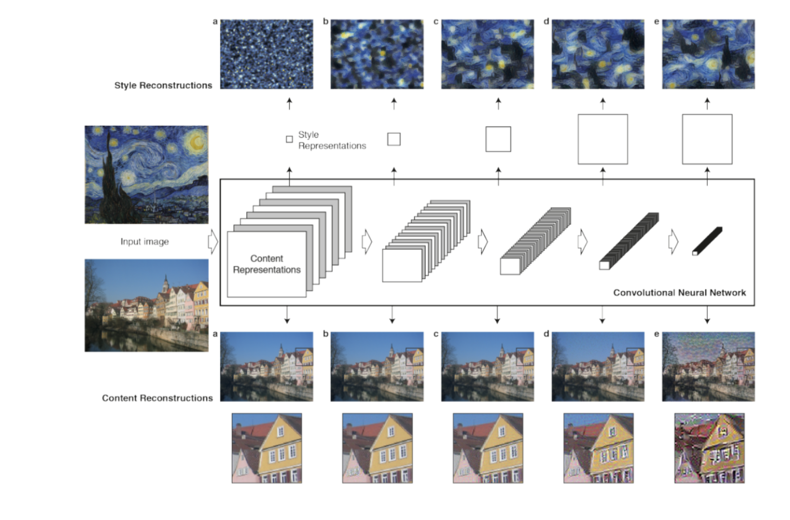
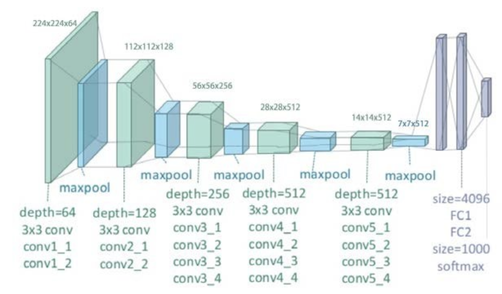
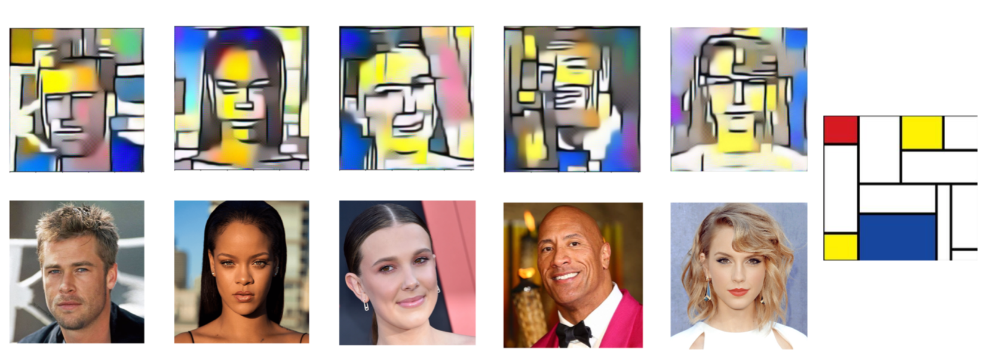
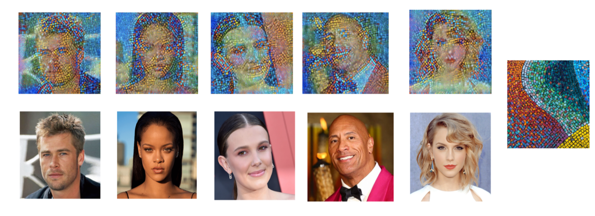
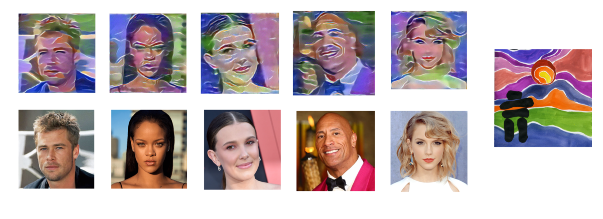
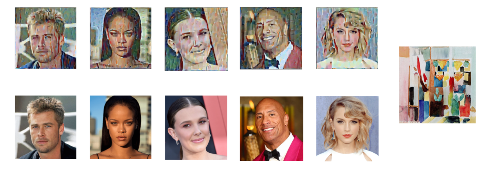
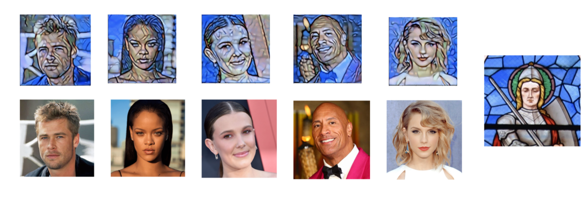

# 585project

## Introduction
The goal of our project is to perform style transformation on paintings with different artistic styles. We found the generating process from reading the paper “Texture Synthesis Using Convolutional Neural Networks” that provides many examples and theoretical fundamentals for us to build a model. The evaluation criterion for the quality of the synthesised texture is usually human inspection, which we applied both qualitative and quantitative evaluation at the end of our project. In general, the whole process is to find two images, a content image and a style image, collect their content element and style element separately and reconstruct a new image and this image has the content with the typical style shown in the picture.   
In our work we tested more than 5 different styles and their impact on different faces. Also we tried different values of key parameters that could influence the performance of our convolutional neural network. In the end we analyzed a series of elements that consist of our qualitative and quantitative evaluation. Due to the time and equipment shortage, we left some problems unsolved and moved them to further study.  


## Implementation
In our project implementation, we use pytorch to perform a series of deep learning algorithms sto take an image and reproduce a new image with a given artistic style.  There are also other libraries, such as tensorflow , also allows us to construct a model that resembles the content and the artistic style of two individual images. Running a neural style transfer model usually takes a long time to train and requires gpu to speed up. We use the function “torch.cuda_is_available” to detect if there is a GPU available. In our project, we need a content image and a style image to reproduce a new image. Therefore the training process does not take too long and we could still perform this task without the support of GPU.



- When loading the image, we have to assign the size of the loading image. Although we could resize the image to guarantee content images have the same size with style images. We still try to set the resolution higher to show them with higher quality.We also rate a function to see how this process works. This function “imshow” shows the content image and the style image.

- The loss function has two terms, content loss and style loss. Both of them are elaborated below

- Content loss is a function that calculates the weighted content distance of an individual layer. We represent the content of an image by the values of intermediate feature maps of a layer L. This is based on an assumption that images that have similar content will have similar representation in the higher layers. Let Lc represents the content loss, then Lc = 0.5*sum(O-F)^2 where O denotes the original image and F represents the final result. This can be calculated by using “nn.MSELoss” that calculates the mean square error between two featured maps. We take the computed loss as a parameter of our module.

- The implementation of style loss is similar to the implementation of the content loss. There are two functions, “gram_matrix” and “StyleLoss”. “Gram matrix” is a transparent process that takes the given matrix and multiplies it with its transposed matrix and outputs a reshaped version of the processing layer. The reshaping process is basically vectorizing the feature maps of each individual layer.  Then the gram matrix is normalized by dividing by the total value of its elements. This normalization makes the gradient descent extremely large in the first layer before the pooling layer and therefore style content is usually in the deeper layer. Style loss is also computed by getting the weighted mean square error between Gs and Go where Gs denotes the manipulated image and Go represents the original image. 

- Then we have to implement our model by using the 19 layer VGG network. All pre-trained models expect input images normalized in the same way.



- Then we need to get the representation of content loss and style loss by implementing VGG 19 and setting it to evaluation mode. Before sending the data into the pre-trained network, This data needs to be normalized with means =[0.485, 0.456, 0.406] and standard deviation = [0.229, 0.224, 0.225] which are given in the code. VGG 19 also contains a series of child modules and we can use the sequential module to make sure the content loss layer and style loss layer are correctly asserted in the network.

- In order to minimize the content loss and style loss, we apply the algorithm to run gradient descent and pass our input image to optimize. By using the function “backward”, we compute the gradient of each module dynamically and update the new losses. We jointly minimise the distance of the feature representations of an initial image from the content representation of the photograph in one layer and the style representation of the painting defined on a number of layers of the CNN.

## Result

- (a) We have perfect results on abstract paint with color blocks. The colors in the style images are equally blended into content images and in the output images, we have clear and sharp contour of human faces and we can recognize who they are by only looking at the output image. The output images consist of lines and color blocks because the style images are full of color blocks and short lines, which shows that the style transfer of abstract paint with color blocks is very successful.

- (b) We also have satisfying results when using a painting called ”TedHarrison” with small color rectangles as style images. If you randomly take one image from the five output images, we can see that the whole image color distribution is very similar to the color distribution of the style image. The edge of human faces are very clear and easy to recognize. They are even sharper than the results using abstract paintings with color blocks. This is because the style image (b) has a sharper edge and this property is reflected in the final output images.

- (c) We also try paintings with water colors and the result shows a very “water-color” style result, which means that our style transfer algorithm does well on water-color paintings. We find a very distinctive style in output images that they have many horizontal curves among the images and the color distribution is very soft. These features show a clear water-color style and the face contours are clear and easy to recognize.

- (d) We have tested Mosaic style paintings  as style images. From the results we find out that the image quality is not so good which we can see some noise and short colored lines inside the image, especially on human faces. The noises make the output images look a bit messy and dirty in its color distribution. However, we can see a clear and sharp edge of human faces. This is because the style image has a bright color style and it matches perfectly with human faces.

- (e) Finally we have a cathedral glass painting with a knight's face on it. The results of style image(e) have the sharpest and clearest face edges. This is because the style image has clear lines that outline the face in the middle of the painting and the color of the face in the painting is very close to the face color in the content images. Therefore we can see that there are glass patterns in the main area of the faces and bright face contours in the output images.  


## Quantitative and Qualitative Evaluation

### Qualitative Evaluation
- We find out that the choice of style images has a great impact on the quality of output image. If we take an Chinese ink painting as the style image, you can hardly get an high quality output image because there are too many details inside the painting that makes the new manipulated image looking a bit messy. If you take Van Gogh’s Starry as the style image, you can get a perfect result because Starry has a clear theme color and lines that divide the painting. In the meantime, content images have a little impact on the quality of the final image. We changed the content image from human faces to dog images and the latter one has better quality because the dog image has fewer details than the human face image.  However, we put more weight on the style image, content image has little impact on the output image. There is another factor that is directly related to the quality of the image, which is the resolution of the images. You can set the size of the input images to (128,128) or (512,512). High resolution images have better quality and it also results in the output images.

### Quantitative Evaluation
- We tested the impact of many factors including content weights, styles weights, different layers of VGG19 and the num of training steps. 

- First if you have large content weights, you will get a similar image or almost the same image as the content image. Therefore large content weights degrades the performance of the style transfer model, which is negative for the whole process. 

- Then we tested several values of style weights. We have better results at 100000 and poor performance on 10. For value 5000, the result stays in the middle, either the image quality and the style transferring performance. 

- If you choose different convolution layers in VGG19 for style processing, you will get totally  different results. We use fixed layer “conv_4” for content processing. Conv_5 gives a lot of green factors and color blocks distributed among the image. Conv_3 gives a terrible result and it has poor performance when using it separately. Conv_1 gives a lot of color dots and it is better than using conv_3 only. And if you are using all 5 convolution layers, you will get a perfect result that is clear and with fine quality.

- For the number of training steps, we get better quality images when we raise the number of training steps. Because we only have our laptop, we tested the number up to 1000 and it takes a great amount of time and the raising number of steps has marginal effect that the raising after a great number has little effect on the upgrading image quality. 

## Challenges and Further Study
- We have encountered plenty of challenges, especially in choosing the style images and trying to match them to appropriate face images. Human faces images are very difficult to process because there are abundant details in the images. These details make it difficult for the final image quality to be improved, especially when you also choose a detailed style image. There are a set of detailed styles such as Chinese ink painting and Picasso’s abstract painting that are not suitable for style transformation. For Chinese ink painting, there are plenty of subtle lines and a lot of white space.These grayish elements make the output images look messy and gray, which degrades the quality of the output image. Abstract paint has the same amount of details or more details than the human face images. This property makes the abstract image difficult to resolve and reconstruct. We can hardly tell the output images are related to this abstract style because the colors and lines seem unrelated in the output image. If we change the neural network there could be some better changes in output images but we have little time to test a new network besides VGG-19. 

- Also due to the restriction of SCC, we use the pretrained network VGG-19 as our neural style transfer network. If we have more time on data collecting, we could choose a larger and more comprehensive neural network. We need to test many parameters of a new neural network and this requires plenty of time. We are very interested in this topic because we are happy to blend different images and manipulate them into different styles. Now we have the fundamental frame of the whole algorithm and we have tested many compositions of the key parameters,  I think we will have better results in the further studies. 


REQUIREMENTS MODULES
------------

This module requires the following modules:

 * Pandas (https://pandas.pydata.org/)
 * Numpy (https://numpy.org/)
 * Matplotlib (https://matplotlib.org/)
 * PyTorch (https://pytorch.org/)
 * Sklearn (https://scikit-learn.org/stable/)
 
 
 
INSTALLATION
------------
Install as you would normally install modules
 * Pandas
 ```
 $ pip install pandas
   ```
 * Numpy 
  ```
 $ pip install numpy
   ```
 * Matplotlib: install from source (recommended)
  ```
$ python -m pip install .
   ```
 * PyTorch 
  ```
 $ pip install torch
   ```

 
FILES DESCRIPTION
------------
 Folders
 * Src: folder of implemented code
 * Results: folder of output images
 * Content: folder of content images
 * Style: folder of style images
 
 Files
 * data_overview: data information, descriptions and plots
 * main: main file with Data class and Config class
 * model: model file with Net class, train, predict and evaluate methods
 * arima: ARIMA model for stocks prediction (for comparison)
 
USAGE
------------

 ```
python main.py 
               
```

   

MAINTAINERS
-----------
Current maintainers:
 * Haoqi Gu - haoqigu@bu.edu
 * Zhichao Lu - zhichaol@bu.edu
 * Chenhui Zhu - zhuch@bu.edu
 
